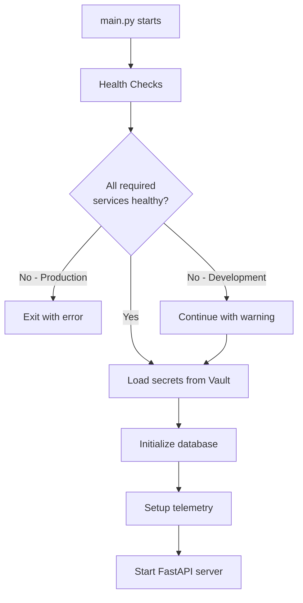

# Infrastructure Architecture

## Overview

DotMac Platform Services follows a **microservices-ready** architecture where the application assumes external dependencies are managed separately. This follows the 12-factor app principles for cloud-native applications.

## Responsibility Separation

### What main.py DOES:
- **Connects** to external services (database, cache, secrets)
- **Validates** service availability at startup
- **Configures** the FastAPI application
- **Loads** secrets from Vault/OpenBao
- **Initializes** database schema (creates tables)
- **Sets up** telemetry and observability

### What main.py DOES NOT DO:
- ❌ Start Docker containers
- ❌ Install databases or other services
- ❌ Manage infrastructure lifecycle
- ❌ Handle service orchestration

## Application Startup Flow



## Service Dependencies

### Required Services (Production)
- **PostgreSQL**: Primary database
- **Redis**: Cache, sessions, rate limiting
- **Vault/OpenBao**: Secrets management (production only)

### Optional Services
- **Celery**: Background task processing
- **Jaeger**: Distributed tracing
- **MinIO**: S3-compatible object storage

## How Services Are Started

### 1. Local Development

```bash
# Start core services
make infra-up

# Or manually with Docker
docker-compose up -d postgres redis openbao

# Start the application
make run-dev
```

### 2. Docker Compose (Full Stack)

```bash
# Start everything
docker-compose up -d

# Start with specific profiles
docker-compose --profile celery --profile observability up -d
```

### 3. Kubernetes (Production)

```yaml
# Services deployed as separate resources
apiVersion: v1
kind: Service
metadata:
  name: postgres
---
apiVersion: apps/v1
kind: Deployment
metadata:
  name: dotmac-api
spec:
  containers:
  - name: api
    image: dotmac-platform:latest
    env:
    - name: DATABASE__HOST
      value: postgres
    - name: REDIS__HOST
      value: redis
```

### 4. Cloud Providers

- **AWS**: RDS (PostgreSQL), ElastiCache (Redis), Secrets Manager
- **GCP**: Cloud SQL, Memorystore, Secret Manager
- **Azure**: Database for PostgreSQL, Cache for Redis, Key Vault

## Health Checks

The application performs health checks at two points:

### 1. Startup Health Checks (Lifespan)
```python
# In main.py lifespan function
checker = HealthChecker()
all_healthy, checks = checker.run_all_checks()

# Fails fast in production if required services missing
if not all_healthy and settings.environment == "production":
    raise RuntimeError("Required services not available")
```

### 2. Runtime Health Checks (Endpoints)
```
GET /health   - Application health
GET /ready    - Readiness with service status
```

## Service Discovery

Services are discovered through environment variables:

```bash
# Database
DATABASE__HOST=localhost
DATABASE__PORT=5432
DATABASE__DATABASE=dotmac
DATABASE__USERNAME=dotmac_user
DATABASE__PASSWORD=<from-vault>

# Redis
REDIS__HOST=localhost
REDIS__PORT=6379
REDIS__PASSWORD=<from-vault>

# Vault/OpenBao
VAULT__ENABLED=true
VAULT__URL=http://localhost:8200
VAULT__TOKEN=<auth-token>
```

## Infrastructure Commands

```bash
# Check what's needed
make infra-status

# Start infrastructure
make infra-up

# Stop infrastructure
make infra-down

# Run application
make run

# Development with hot reload
make run-dev
```

## Production Deployment

In production, services are typically:

1. **Managed Services**: Use cloud provider managed services (RDS, ElastiCache)
2. **Kubernetes**: Deploy as separate StatefulSets or use operators
3. **Docker Swarm**: Deploy as separate services in the swarm
4. **Traditional**: Install on separate VMs with configuration management

The application **never** manages its own infrastructure - it only connects to what's provided.

## Environment-Specific Behavior

### Development
- Continues even if optional services are unavailable
- Uses SQLite if PostgreSQL unavailable
- Shows helpful error messages
- Enables hot reload and debug mode

### Production
- Fails fast if required services unavailable
- Requires Vault/OpenBao for secrets
- Enforces security validations
- Optimized for performance

## Troubleshooting

### Service Won't Start
```bash
# Check service health
make infra-status

# View detailed logs
docker-compose logs postgres
docker-compose logs redis

# Test connectivity
nc -zv localhost 5432  # PostgreSQL
nc -zv localhost 6379  # Redis
nc -zv localhost 8200  # Vault
```

### Application Can't Connect
```bash
# Check environment variables
env | grep DATABASE
env | grep REDIS

# Test from application
poetry run python -c "from src.dotmac.platform.health_checks import HealthChecker; HealthChecker().get_summary()"
```