# DotMac Platform - User Journey Documentation

This document outlines the complete user journeys for all user types in the DotMac Platform Services ecosystem.

## Table of Contents

1. [Overview](#overview)
2. [User Types](#user-types)
3. [Platform Admin Journeys](#platform-admin-journeys)
4. [Tenant User Journeys](#tenant-user-journeys)
5. [Partner Journeys](#partner-journeys)
6. [Cross-Cutting Flows](#cross-cutting-flows)

---

## Overview

DotMac Platform Services is a multi-tenant SaaS control plane with three distinct portal experiences:

| Portal | URL Path | Primary Users |
|--------|----------|---------------|
| Admin Dashboard | `/dashboard/*` | Platform Administrators |
| Tenant Portal | `/portal/*` | Tenant Account Holders |
| Partner Portal | `/partner/*` | ISP Partners & Resellers |

---

## User Types

### Platform Administrator
- Full system access
- Manages all tenants, users, billing, and deployments
- Access to analytics and monitoring
- Configures platform settings

### Tenant User
- Organization-scoped access
- Manages team members within tenant
- Views billing and usage
- Configures tenant settings

### Partner
- Referral program participant
- Tracks commissions and referrals
- Manages referred tenants
- Views financial statements

---

## Platform Admin Journeys

### 1. Admin First-Time Setup

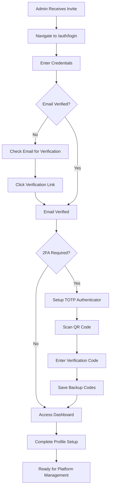

### 2. User Management Journey

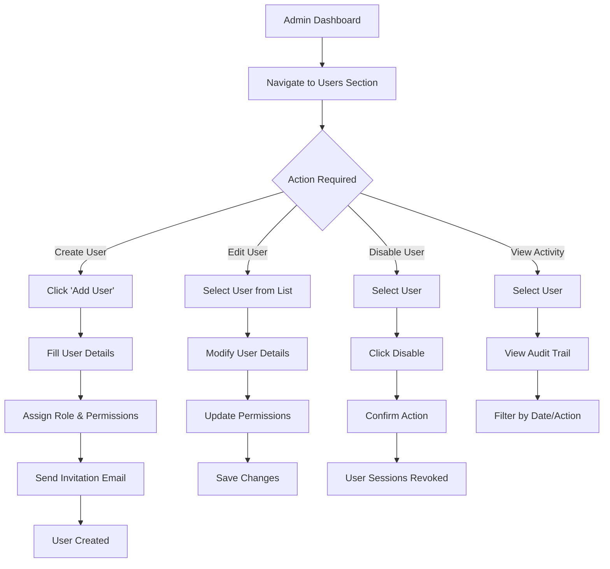

### 3. Tenant Management Journey

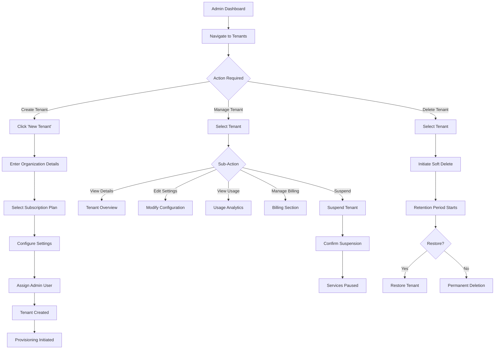

### 4. Billing Administration Journey

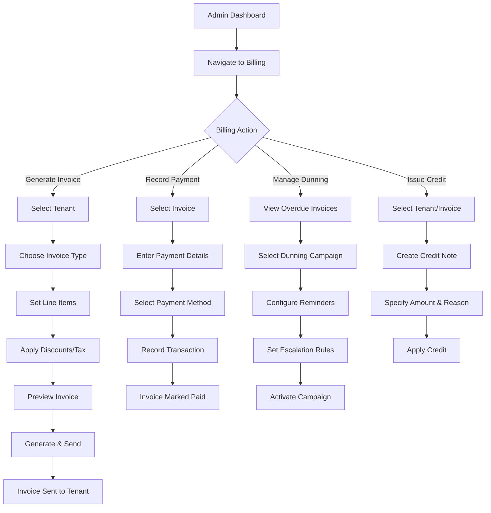

### 5. Deployment Management Journey

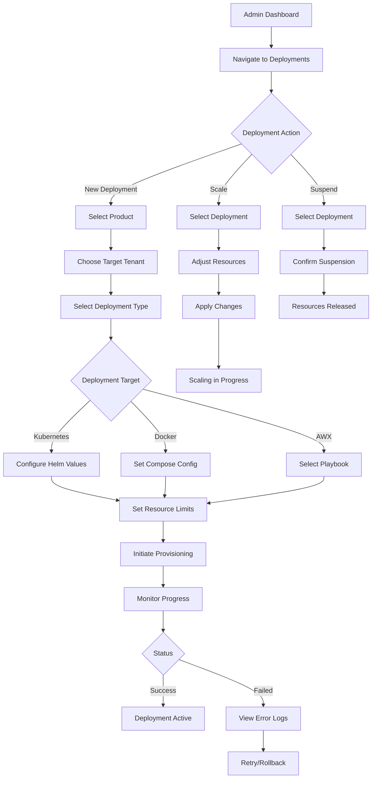

### 6. Analytics & Monitoring Journey

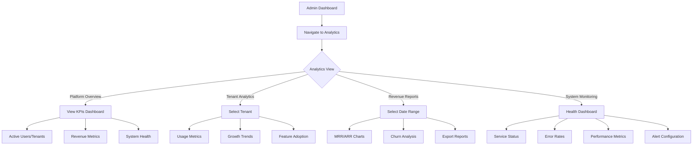

---

## Tenant User Journeys

### 1. Tenant Self-Signup Journey

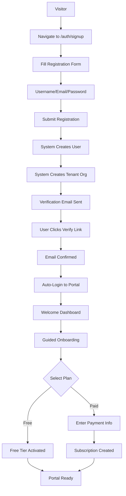

### 2. Tenant Portal Dashboard Journey

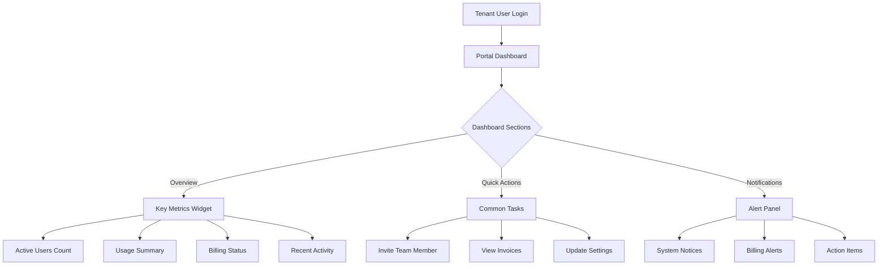

### 3. Team Management Journey

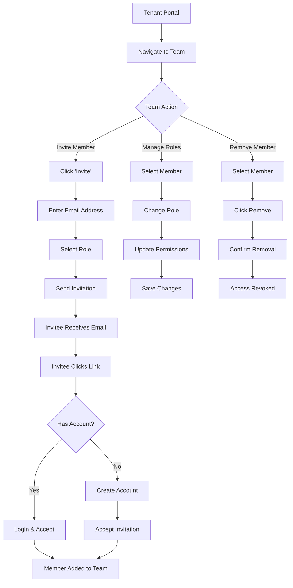

### 4. Tenant Billing Journey

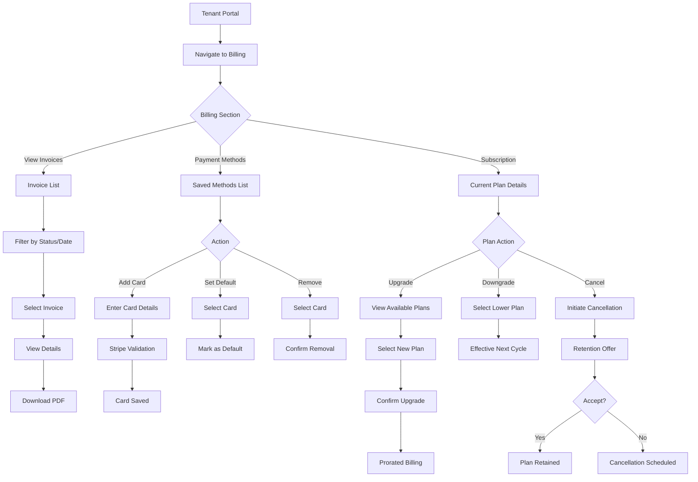

Note: Payment method management is planned; current tenant portal surfaces placeholders for add/edit actions but does not persist payment methods yet.

### 5. Tenant Usage Monitoring Journey

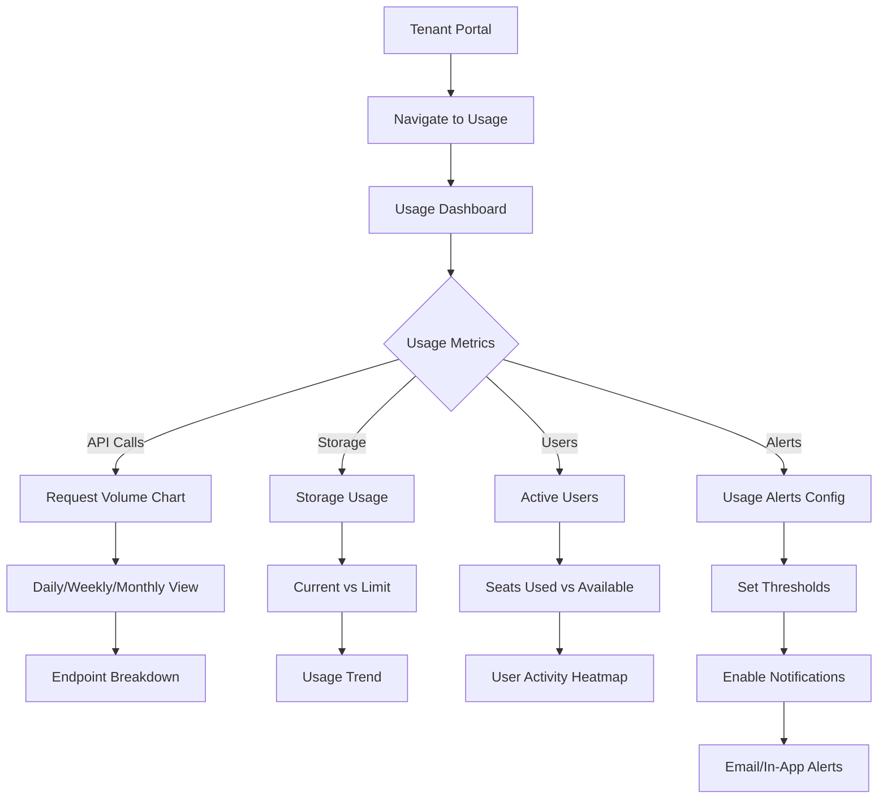

### 6. Tenant Settings Journey

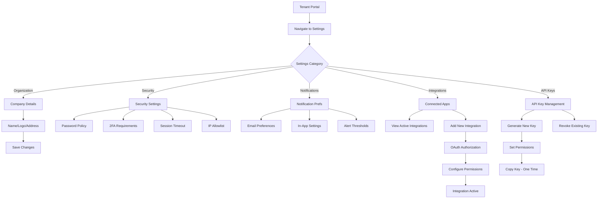

---

## Partner Journeys

### 1. Partner Registration Journey

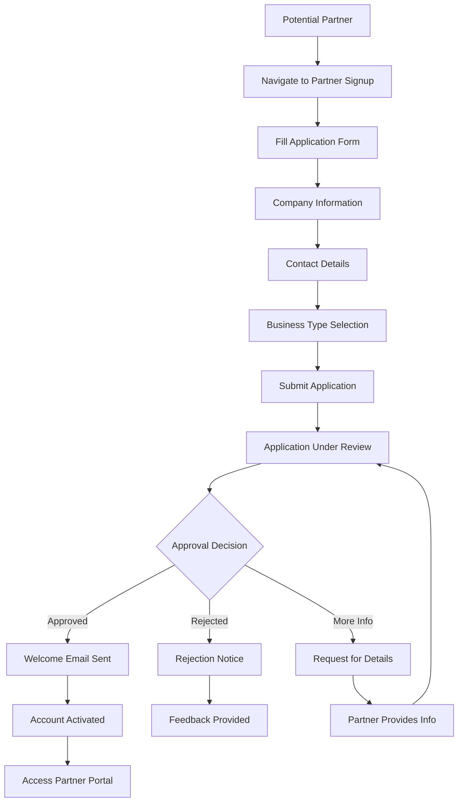

### 2. Partner Dashboard Journey

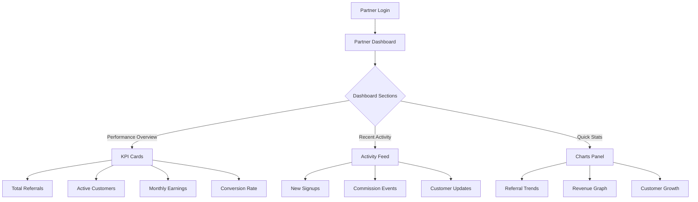

### 3. Referral Management Journey

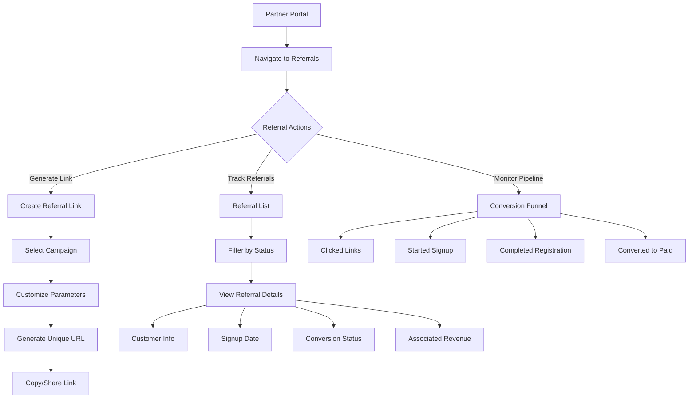

### 4. Commission Tracking Journey

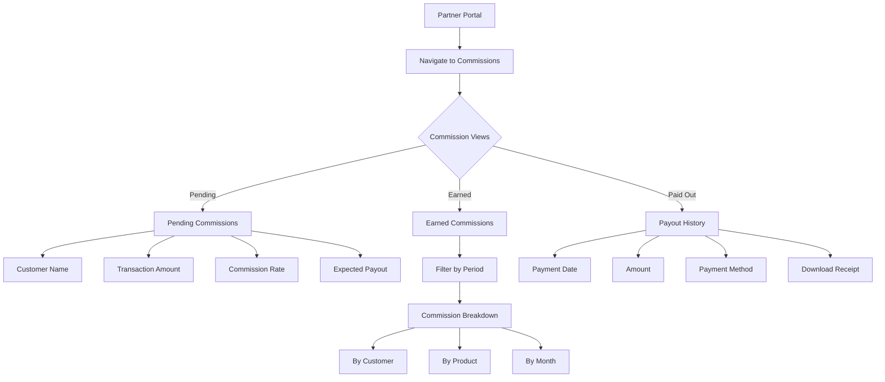

### 5. Partner Financial Statements Journey

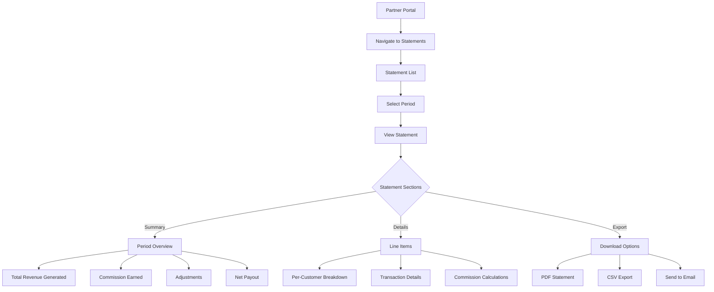

### 6. Partner Tenant Management Journey

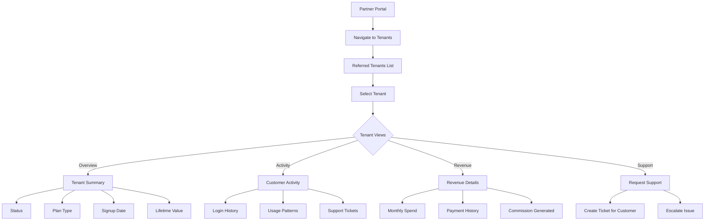

---

## Cross-Cutting Flows

### 1. Authentication Flow

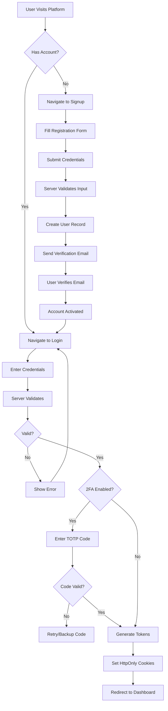

### 2. Password Reset Flow

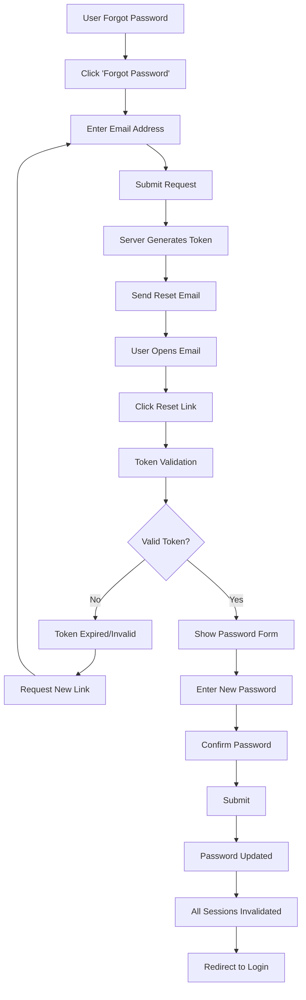

### 3. Session Management Flow

```mermaid
flowchart TD
    A[User Makes Request] --> B[Extract Access Token]
    B --> C{Token Present?}
    C -->|No| D[Return 401]
    C -->|Yes| E[Validate JWT]
    E --> F{Token Valid?}
    F -->|No| G{Expired?}
    G -->|Yes| H[Try Refresh Token]
    H --> I{Refresh Valid?}
    I -->|Yes| J[Issue New Access Token]
    J --> K[Continue Request]
    I -->|No| L[Return 401 - Re-login]
    G -->|No| M[Return 401 - Invalid]
    F -->|Yes| N[Extract User/Tenant Context]
    N --> O[Check Permissions]
    O --> P{Authorized?}
    P -->|Yes| K
    P -->|No| Q[Return 403]
```

### 4. Invoice Lifecycle Flow

```mermaid
flowchart TD
    A[Invoice Creation] --> B[Draft Status]
    B --> C[Add Line Items]
    C --> D[Calculate Totals]
    D --> E[Apply Tax]
    E --> F[Generate Invoice Number]
    F --> G[Finalize Invoice]
    G --> H[Pending Status]
    H --> I[Send to Customer]
    I --> J{Payment Received?}
    J -->|Yes| K[Payment Recorded]
    K --> L[Paid Status]
    J -->|No| M{Due Date Passed?}
    M -->|Yes| N[Overdue Status]
    N --> O[Dunning Campaign]
    O --> P[Send Reminders]
    P --> Q{Payment After Reminder?}
    Q -->|Yes| K
    Q -->|No| R{Max Retries?}
    R -->|No| P
    R -->|Yes| S[Escalate - Suspend Tenant]
    M -->|No| T[Wait]
    T --> J
```

### 5. Subscription Lifecycle Flow

```mermaid
flowchart TD
    A[New Subscription] --> B[Trial Period]
    B --> C{Trial Expires}
    C --> D{Converted to Paid?}
    D -->|Yes| E[Active Subscription]
    D -->|No| F[Subscription Expired]

    E --> G{Monthly Cycle}
    G --> H[Generate Invoice]
    H --> I[Process Payment]
    I --> J{Payment Success?}
    J -->|Yes| K[Continue Service]
    K --> G
    J -->|No| L[Grace Period]
    L --> M[Retry Payment]
    M --> N{Retry Success?}
    N -->|Yes| K
    N -->|No| O{Max Retries?}
    O -->|No| M
    O -->|Yes| P[Suspend Subscription]

    E --> Q{User Cancels?}
    Q -->|Yes| R[Cancellation Scheduled]
    R --> S[Service Until Period End]
    S --> T[Subscription Cancelled]

    E --> U{Upgrade/Downgrade?}
    U -->|Yes| V[Plan Change]
    V --> W[Prorated Adjustment]
    W --> E
```

### 6. Multi-Factor Authentication Setup Flow

```mermaid
flowchart TD
    A[User Settings] --> B[Navigate to Security]
    B --> C[Click Enable 2FA]
    C --> D[Server Generates Secret]
    D --> E[Display QR Code]
    E --> F[User Scans with Auth App]
    F --> G[Enter Verification Code]
    G --> H{Code Valid?}
    H -->|No| I[Show Error]
    I --> G
    H -->|Yes| J[Generate Backup Codes]
    J --> K[Display Backup Codes]
    K --> L[User Saves Codes]
    L --> M[Confirm Saved]
    M --> N[2FA Activated]
    N --> O[All Sessions Require 2FA]
```

### 7. API Key Management Flow

```mermaid
flowchart TD
    A[User/Admin Portal] --> B[Navigate to API Keys]
    B --> C{API Key Action}

    C -->|Create| D[Click Generate Key]
    D --> E[Enter Key Name]
    E --> F[Select Permissions]
    F --> G[Set Expiration]
    G --> H[Generate Key]
    H --> I[Display Key Once]
    I --> J[User Copies Key]
    J --> K[Key Active]

    C -->|Rotate| L[Select Existing Key]
    L --> M[Click Rotate]
    M --> N[New Key Generated]
    N --> O[Old Key Deprecated]
    O --> P[Grace Period]
    P --> Q[Old Key Revoked]

    C -->|Revoke| R[Select Key]
    R --> S[Click Revoke]
    S --> T[Confirm Revocation]
    T --> U[Key Immediately Invalid]
```

---

## Appendix: User Role Permissions Matrix

| Feature | Platform Admin | Tenant Admin | Tenant Member | Partner |
|---------|---------------|--------------|---------------|---------|
| Manage All Users | Yes | No | No | No |
| Manage Tenant Users | Yes | Yes | No | No |
| View All Tenants | Yes | No | No | No |
| Manage Own Tenant | Yes | Yes | Limited | No |
| Platform Billing | Yes | No | No | No |
| Tenant Billing | Yes | Yes | View Only | No |
| Deployments | Yes | No | No | No |
| Analytics (Platform) | Yes | No | No | No |
| Analytics (Tenant) | Yes | Yes | Yes | Limited |
| Partner Management | Yes | No | No | Self |
| System Settings | Yes | No | No | No |
| Tenant Settings | Yes | Yes | Limited | No |

---

## Document Metadata

| Property | Value |
|----------|-------|
| Version | 1.0.0 |
| Last Updated | 2024 |
| Status | Active |
| Owner | Platform Team |
